#### navicat 15.0 断网 安装

- 1. 下载压缩包
      链接：https://pan.baidu.com/s/1MvlfDvR7GU-GCQGQZrQojg 
提取码：bjma
      
- 2. 解压压缩包
      
- 3. 预安装 Navicat
     
- 3.1 安装 Navicat 软件
    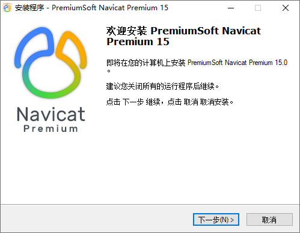
    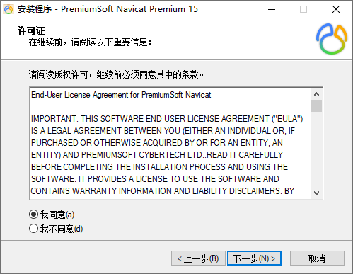

    ```
        不建议安装在C盘，路径可自行调整，后续 Patch 时会用到
    ```

    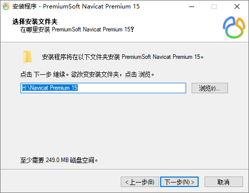
    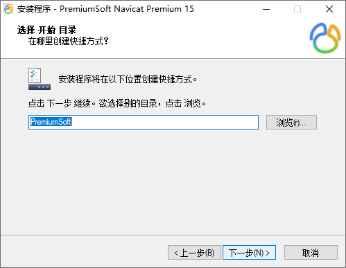
    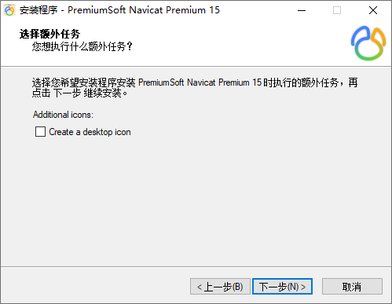
    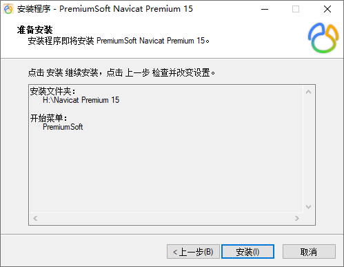
    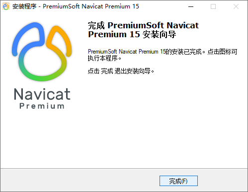

- 4. 断网
     

- 5. 预安装
      
- 5.1 安装 Key Patch 破解软件

    ```
       注意事项
       
       1. Patch 时 需要选择自定义安装路径中的Navicat.exe
       2. 不能够Patch 得到 Cracked时，卸载重装Navicat
       3. 密钥、请求码、激活码 在Navicat、Keygen 之间不能自动复制时，需要手动复制
    ```

    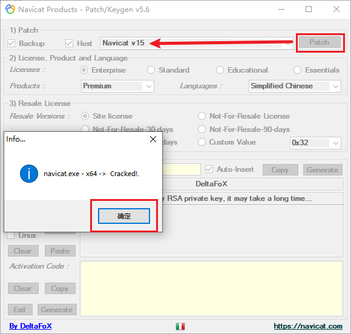
    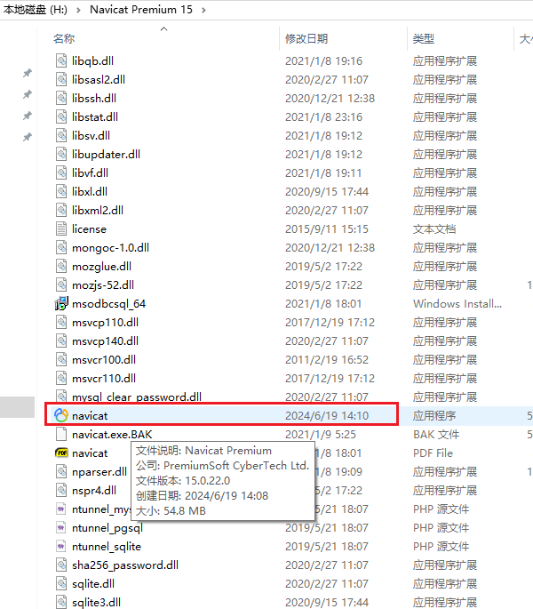
    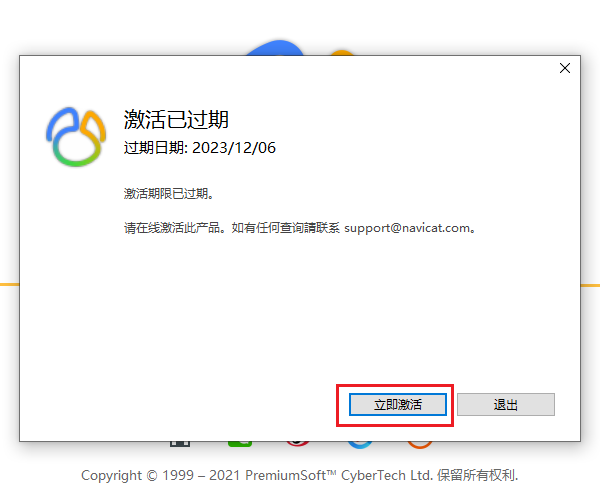
    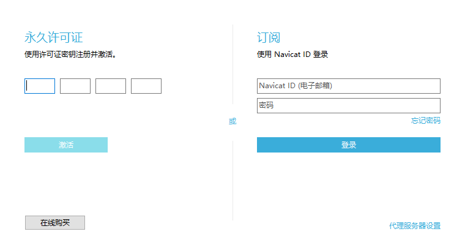
    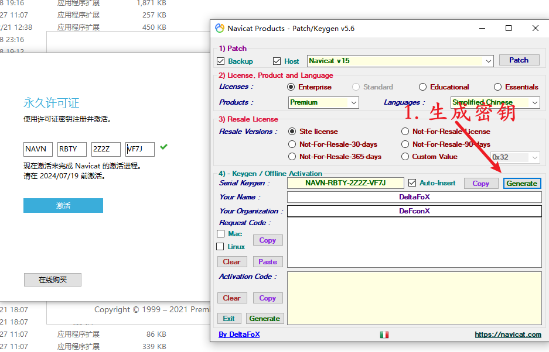
    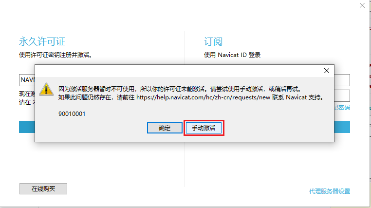
    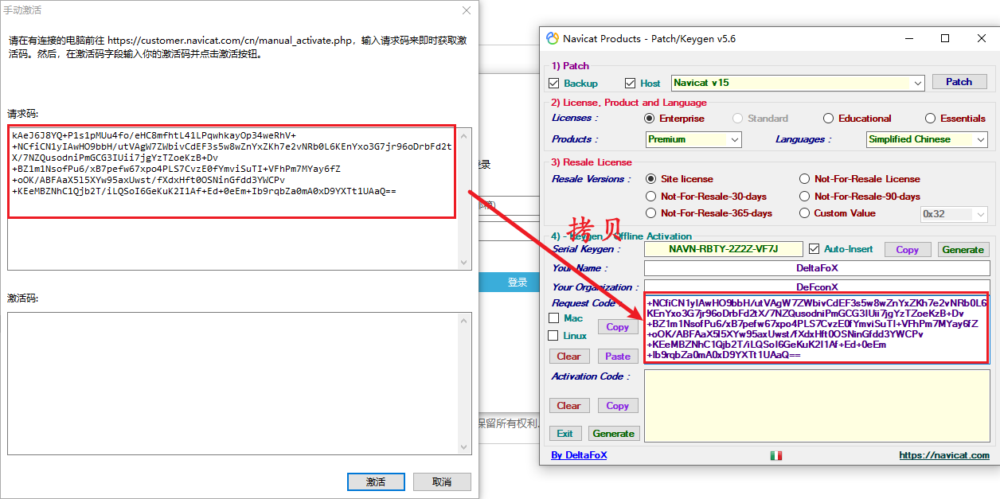
    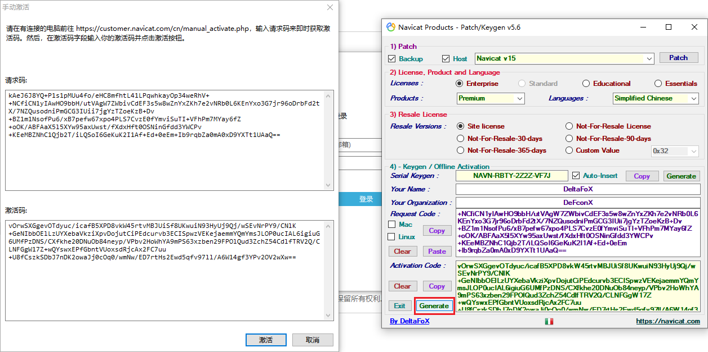
    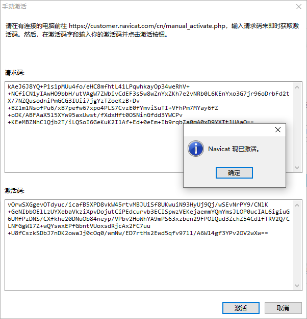
- 5.2 效果
      
